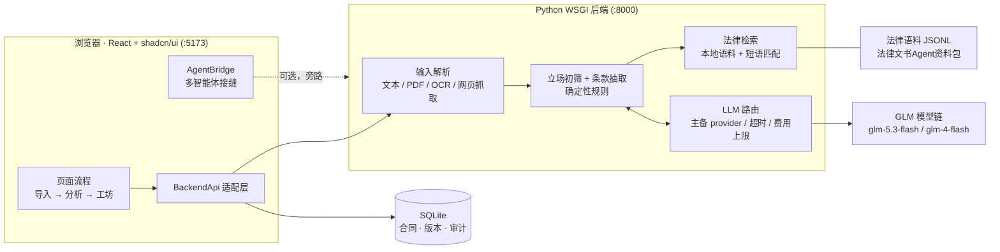

# 约定 YUEDING · 产品手册

读懂约定，再做决定。

签租房合同之前，你大概干过这样的事：把 PDF 拖进聊天框问 AI「这条对我有没有坑」，得到一段洋洋洒洒、但说不清依据在第几页的回答。「约定」想解决这个问题——把合同拆成能核对的原文、能追问的条款、能直接拿去沟通的草稿，每一步都能回到原文，找不到依据就明说找不到。

这份手册面向两类人：用「约定」读合同的普通用户，以及想把它接到自己系统里的开发者。写的是产品现在的真实样子，包括它做不到的事。

## 产品简介

「约定」是一个跑在浏览器里的合同阅读器，重点覆盖中国大陆个人用户最高频的几类文本：**租房合同、隐私协议、劳动合同、装修合同、培训协议、摄影服务合同**。租房是最完整的场景，其余类型走同一套分析链路。

一次完整的使用大致是这样：导入材料（粘贴、PDF、截图或网页链接）→ 选择立场（比如承租人）→ 看条款卡片和原文对照 → 追问关心的点 → 进协商工坊，把结论变成一份可以复制发出去的消息草稿。整个过程你可以随时切到原文标签，核对每条结论是不是真的写在合同里。

有几件事我们刻意不做，先说清楚：

- **不收费**。没有支付，没有会员，没有按次计费。
- **不代替律师**。输出是「辅助阅读 + 沟通草稿」，不是法律意见，也不做个案裁判。
- **不自动签约、不自动发送**。任何草稿都要你自己核对、自己复制、自己通过自己的渠道发出去。

## 快速开始

需要 Node.js 18+ 和 Python 3.11+。前后端分开启动，两个终端：

```sh
# 终端 1：启动后端（127.0.0.1:8000）
cd backend
bash start-dev.sh

# 终端 2：启动前端（http://localhost:5173）
cd frontend
npm install   # 首次
npm run dev
```

然后浏览器打开 <http://localhost:5173>。前端检测到 localhost 会自动连本地后端，不需要额外配置。确认后端活着可以访问 <http://127.0.0.1:8000/healthz>。

几点说明：

- `start-dev.sh` 会加载内置法律语料（`backend/data/legal_corpus.jsonl`），并在能找到 API key 时配置 GLM 模型链（主 `glm-5.3-flash`、备 `glm-4-flash`）。没有配 key 也能跑：条款卡片、原文定位、法律检索这些确定性能力照常工作，只是「深度分析」和 LLM 版草稿不可用。
- 脚本默认用 `backend/.venv/bin/python`。如果还没有虚拟环境，先 `python3 -m venv .venv && .venv/bin/pip install -r requirements.txt`，或者直接用 README 里的裸命令起服务。
- 完全不想起后端也行。把 `YUEDING_BACKEND_CONFIG` 的 `baseUrl` 设为空字符串（见「开发者接入指南」），前端进入纯本地模式：示例合同、关键词定位、沟通模板全部可用，零网络请求。
- 想挂到公网做演示，用仓库里的单端口方案（见「公网演示部署」）。

### 公网演示部署（可选）

`frontend/serve_demo.py` 把构建产物和后端 API 收进同一个端口，浏览器端零 CORS 配置：

```sh
cd frontend
npm run build
python3 serve_demo.py    # 0.0.0.0:8000 托管 dist/，API 反代到 127.0.0.1:8001
```

反代路径为 `/v1/`、`/contracts/`、`/legal/`、`/kb/`、`/healthz`、`/readyz`（环境变量 `BACKEND_HOST` / `BACKEND_PORT` 可改），并向 index.html 注入同源后端配置，公网 IP、SSH 隧道、本机打开行为一致。后端相应用 `CONTRACT_READER_PORT=8001 bash start-dev.sh` 启动。不想动 HTML 时，也可以直接在页面 URL 上加 `?backend=https://你的后端地址` 指定后端（优先级最高）。

## 功能详解

### 导入材料

首页提供四种进料方式，标签页切换：

**粘贴文本**。最直接的方式，把合同正文贴进来就行。停笔约一秒后，页面会基于文本生成「猜你想问」——几个大概率是你关心点的问题（押金怎么退、能不能提前走之类的），点一个就能带着问题进分析。

**上传 PDF**。支持点击选择和拖拽进上传框。可检索的 PDF 直接提取文字层；扫描件没有文字层的，走 OCR。文件解析完成后会显示「已解析 N 页」和前 200 字的预览，接着自动生成猜你想问。文件大小限制分两档：**纯本地模式下 20 MB，启用后端后 5 MB**（后端接收上限更紧，报错会直接提示）。

**截图 OCR**。合同照片、聊天记录里的协议截图都可以拖进来，走 macOS Vision OCR 识别文字（预编译二进制，多页并发，一般秒级返回）。注意这条链路目前依赖 macOS，Linux 服务器上没有对应实现。

**输入链接**。贴一个网页地址，后端抓取正文（上限 2 MB）后进入同一条分析链路。适合挂在网上公示的隐私协议。动态渲染的页面（大量 JS 拼出来的内容）抓不全，这种就老老实实复制正文到文本框。

不点「开始分析」之前，一切只停留在本地；示例合同（租房、隐私、劳动、装修、培训、摄影六类）可以一键载入，内容都是虚构的，用来快速走通流程。

### 分析阅读

分析页是左右双栏：左栏是合同条款列表，右栏从上到下是问答区和三个标签页——**分析 / 原文 / 智读**。


**分析**标签展示条款卡片。租房场景下，押金、房屋改动、维修、提前退租四类条款由后端确定性规则生成，每张卡片带原文引用、页码和「对用户的影响」。点左栏任意条款，右栏联动展示；反过来点卡片也能高亮原文位置。

**立场初筛**是这里的关键功能。选择你的立场（租房：承租人/出租人；隐私：数据主体/个人信息处理者；劳动：员工/用人单位），后端按立场对条款打标：对我方**不利 / 有利 / 中性 / 待确认**，附关注度排序。同一份合同，承租人和出租人看到的重点清单是不一样的。顶部会显示当前立场和使用的引擎，立场可以随时切换重筛。

**原文**标签是完整的合同正文，选中条款自动滚动定位。这是我们对「AI 说合同说了 X」的基本防线：任何结论你都能在一屏之内验证它到底写没写。

**智读**标签做三件事：

- **义务清单**——从条款里提取带时间要求的义务（「提前三十日书面通知」「七日内退还押金」），标注责任方和期限，可以逐条勾选完成，适合签完之后当履约清单用。
- **术语表**——合同里的「承租人」「隐蔽工程」「交付物」这类术语，在左栏条款里以下划虚线标出，鼠标悬浮即出释义，不用再去搜。
- **交叉引用**——条款里出现「按第六条执行」这类引用时显示为蓝色虚线链接，点击直接跳到对应条款，长合同里来回翻页的痛苦少一大半。


### 提问反馈

分析页顶部随时可以输入问题继续追问，自由文本，不用管格式。后端会重新定位相关条款并给出带原文引用的回答；回答下方保留「查看原文」按钮，定位不到的段落明确显示「未找到相关约定」，不编。

不想打字的时候，「猜你想问」一直挂在首页和分析页：导入后自动生成，本地模式基于关键词，后端模式由模型基于已解析的合同内容生成。选中即问。

**深度分析**是追问的加强版（需要配置 LLM）：把初筛结果里标记为不利的条款、你的立场一起交给模型，产出一段综合解读和协商建议，标记「由 GLM 基于合同证据生成」。深度分析的输入受证据约束——模型只能引用已经定位到的条款，不能凭空补内容。

### 协商工坊

看完分析，问题往往变成「那我怎么跟对方说」。协商工坊把这一步也接上了。

从分析页选中一条条款进入工坊，左栏写你的目标（「我想在客厅装书架」「希望押金退还时间写明」），勾选可接受的条件（比如「退租时恢复墙面」），点生成，得到三份草稿：

1. **消息草稿**——给对方的确认消息，口吻是「我们能否一起确认」，不是下通牒；
2. **备选方案**——如果对方不接受原方案，退一步的替代写法；
3. **补充约定**——可以直接附在合同后的补充条款草稿，关键处留了「由双方填写」的空位。

三份草稿都可以直接编辑改写，改完一键复制。


要说三遍的事这里说一遍：**草稿不会自动发送给任何人**。「约定」不接入你的聊天工具、邮件、短信，也不代你签约。复制之后发不发、发给谁、怎么改口吻，都是你的决定。补充约定尤其需要双方核对后才有效力——它是帮你把话题摆上桌子的，不是替你成交的。

本地模式下草稿由预设模板生成；配置了 LLM 后，本地模板先上屏（页面永不空白），模型结果返回后覆盖，并标注生成来源。

### 我的合同

分析过的合同出现在「我的合同」列表里，点开即回到对应的分析会话。前端侧这份列表是会话级的，刷新即清空；但只要后端在，每次上传都会写入 SQLite 的合同和版本记录（含 SHA-256、质量指标），从列表重新载入时走的是后端持久化的数据，不是浏览器缓存。一个版本对应一次导入，重复上传同一份文件会各自留痕。

### 模板库

顶部导航的「模板库」收录六种虚构示例合同——租房、隐私、劳动、装修、培训、摄影，每种带要点标签和一句介绍，是走通完整流程最快的入口。点击卡片后会用真实界面回放一遍完整使用旅程：自动回到主页并「拖入」示例 PDF、解析出页数与预览、「猜你想问」逐条出现、自动选中一条填入问题框、进入分析页走完回答加载；停留数秒后生成深度分析与协商拟写，再停留数秒进入协商工坊的消息草稿界面，最后演示结束、页面静止可交互（全程约十八秒，演示期间顶部有提示条可随时取消）——每一步都和真实使用走同一套界面与建议来源。示例内容全部虚构，不是可直接签署的合同范本。

### 法条知识库

合同里的话靠不住的时候，你得看法律怎么说的。知识库页面分两层：

- **全部文档**：完整的法律法规和示范文书原文，来自项目内置的离线语料包（`法律文书Agent资料包`，含维基文库法律法规和官方示范文书，如《住房租赁条例》、市场监管总局《城镇房屋租赁合同》2025 版、《个人信息保护法》等）。全部本地存放，不联网。
- **条文速查库**：从语料包提炼的 **114 条条文速查**，按主题打了标签（押金、维修责任、提前解约、 consent 撤回……），配合全文检索定位。

搜索是确定性的短语匹配，不走 LLM——命中就是命中，没命中就告诉你没有，不会有一段「看起来像法条」的生成文本。分析页的条款对齐也是基于同一套语料：条款卡片引用的法条能点回知识库原文。

需要后端服务在线，纯本地模式下知识库页面会提示启动后端。


### 帮助中心

页面右上一路可达，六个常见问题，答案和产品行为一一对应（本手册「常见问题」一节即其完整版）。迷路了先去那里。

## 架构说明

一句话：浏览器里的 React 单页应用，通过 HTTP 调一个纯标准库的 Python WSGI 后端；后端管解析、SQLite 持久化、确定性法律检索和受证据约束的 LLM 调用。



几条设计约束，也是这个原型的骨架：

- **确定性优先**。条款抽取、法条检索、立场初筛是规则代码，不经过 LLM。模型只消费已经过校验的合同证据和法律候选，输出写入固定 schema 并做引用存在性校验——引用不落在原文里的内容会被丢弃。找不到依据就返回「未找到相关约定」，不补写结论。
- **降级路径**。后端不在 → 本地关键词定位 + 模板草稿；LLM 不在 → 确定性结果照常；OCR 质量不足 → 标记 `needs_review`，不猜内容。任何一层缺失，页面都不会白屏。
- **合同内容是数据不是指令**。导入的文本不参与任何系统提示词拼接，日志只记 ID、状态和字节数，不落合同正文。
- 后端是多线程 WSGI（标准库 `wsgiref` + `ThreadingMixIn`），LLM、OCR 这类慢请求不会阻塞整个服务；提供 `/healthz`、`/readyz`、`/metrics`。

## 常见问题

**这份网站可以做什么？**

体验导入、原文对照、条款定位、提问反馈、协商模板生成、编辑与复制。租房、隐私和劳动合同示例均为虚构。

**分析结果从哪里来？**

示例合同使用预先编写的解读；启用后端后，文本和可检索 PDF 由后端提取页级原文，用确定性规则生成押金、改动、维修和提前退租条款卡片，后端找不到依据或文档质量不足时会保留不确定性。启用后端时还会按你选择的立场（如承租人/出租人）对条款做初筛，标注「对我方不利/有利/中性/待确认」和关注度，并可一键发起深度分析与协商拟写（需配置 LLM）。

**PDF、截图与链接如何使用？**

启用后端时，可检索 PDF 直接提取文字层；没有文字层的扫描 PDF 和图片截图调用 macOS Vision OCR 识别文字（预编译二进制 + 多页并发，秒级返回）。「输入链接」由后端抓取网页正文（≤2MB）进入同一分析链路；动态渲染页面请复制正文到文本框。

**合同内容会被保存吗？**

未配置后端时，内容只在浏览器页面内存中处理。配置后端时，上传内容会写入后端合同版本和 SQLite 数据库；前端的「我的合同」仍只记录本次会话，刷新后清空（后端记录仍在，可重新载入）。

**生成的消息会自动发送吗？**

不会。你可以修改并复制草稿，由你决定何时通过自己的沟通渠道发送。补充约定也需要双方核对后确认。

**接入后端或智能体后，合同内容会发送到哪里？**

后端配置通过 `YUEDING_BACKEND_CONFIG` 指定，合同会发送到该地址的合同接口；智能体配置通过 `yueding/docs/MULTI_AGENT_INTERFACE.md` 描述的协议指定。任一服务不可用时，前端保留本地关键词定位和沟通模板，功能不中断。

## 隐私与数据说明

「约定」处理的是你人生里挺私密的一类文本，数据处理规则值得单独写一节：

- **纯本地模式**（未配置后端和智能体）：零网络请求。粘贴的文本、选择的文件只存在于页面内存，关掉标签页就没了。
- **本地后端模式**：合同写入本机 SQLite。后端日志只记录 ID、状态码、字节数这类元数据，不记合同正文、不记凭据、不记完整个人信息。上传接口的错误响应固定为 `{"error":{"code","message"}}`，不回显原文。
- **LLM 调用**：仅在「深度分析」「协商拟写」「猜你想问」时发生，且输入是已校验的证据和条款，不是整份合同的自由发挥。模型链由部署方自己配置（默认指向 BigModel 的 GLM 端点），我们不中间转一手。
- **你自己部署时**：一旦把后端或智能体端点暴露到公网，用户合同就会明文发往该端点。请强制 HTTPS、在页面向用户说明、端点侧最小化留存。各辖区对「自动化法律建议」监管不同，文案边界请自行评估。

删除数据的方式很朴素：本地模式关页面即删；本地后端模式删掉 SQLite 文件即删。当前原型没有提供导出和账户级删除接口——这是已知缺口，见「版本状态」。

## 开发者接入指南

### YUEDING_BACKEND_CONFIG：指定标准后端

前端在 `index.html` 加载业务代码之前解析后端地址，优先级从高到低：

1. `?backend=https://…` URL 查询参数——公网演示（如 CF Tunnel）时直接在链接里指定后端；
2. 页面预写的 `window.YUEDING_BACKEND_CONFIG.baseUrl`——部署时写进 HTML；
3. `localhost / 127.0.0.1` 自动指向 `http://127.0.0.1:8000`；
4. 其他域名默认空字符串——纯本地模式，前端不发任何请求。

```html
<script>
  var qs = new URLSearchParams(location.search)
  var fromQuery = qs.get('backend')
  var isLocal = /^(localhost|127\.0\.0\.1)$/.test(location.hostname)
  window.YUEDING_BACKEND_CONFIG = Object.assign(
    { baseUrl: isLocal ? 'http://127.0.0.1:8000' : '', timeout: 60000 },
    window.YUEDING_BACKEND_CONFIG || {},
    fromQuery ? { baseUrl: fromQuery.replace(/\/$/, '') } : {}
  )
</script>
```

- 部署到其他域名时，覆盖 `baseUrl` 指向你的后端地址（或直接用 `?backend=` 参数）；
- 后端侧记得配 CORS：`CONTRACT_READER_CORS_ORIGINS` 设为逗号分隔的完整 origin（不要用 `*`）。

前端所有页面通过单一客户端模块（`frontend/src/api/client.ts`）调用后端，主要接口：`POST /v1/contracts`（上传，字段名 `file`）、`POST .../analyze`、`POST .../screen`（立场初筛）、`POST .../generate`（深度分析，需 LLM）、`GET /v1/legal/search?q=`。错误结构统一，响应形状在客户端层做过归一。

### AgentBridge：接入你自己的智能体编排

如果想用自己的多智能体系统（LangGraph / AutoGen / 自建路由均可）替换分析链路，走 `AgentBridge` 接缝，不碰业务代码：

```html
<script>
  window.YUEDING_AGENT_CONFIG = {
    endpoint: 'https://your-domain.example/api/agent', // 必填
    headers: { 'Authorization': 'Bearer <token>' },    // 可选
    timeout: 60000                                     // 可选
  };
</script>
<script src="app.js"></script>
```

协议是单个 HTTP 端点、按能力路由：

```json
// POST <endpoint>
{
  "capability": "analyze | draft | extract",
  "payload": { "…": "与能力对应的负载" },
  "client": "yueding-web",
  "version": 1
}
// 成功：HTTP 200 + { "result": { … } }
// 失败：非 200，或 200 + { "error": "人类可读的说明" }
```

三个能力：`analyze`（条款定位 + 问答，返回 `findings` 和 `answer`，`index` 指向传入的条款数组下标）、`draft`（协商草稿，返回 `message` / `alternative` / `supplement` 三个可选字段）、`extract`（PDF/截图提取，当前 UI 预留）。失败、超时、格式不符时前端自动回退本地实现并 toast 提示，页面不中断。

两条硬规矩：返回的条款 `index` 越界会被直接忽略（防幻觉）；草稿必须保持「待双方确认」的中性口吻，不得输出确定性法律结论。浏览器内场景还可以走 JS Provider（`window.YuedingAgent.registerProvider`），完整协议和一个零依赖的 Node 示例服务端见 `yueding/docs/MULTI_AGENT_INTERFACE.md` 和 `yueding/examples/agent-server.example.mjs`。

## 版本状态

这是一个 **Hackathon 原型**，按后端完整体验收条目估算整体完成度约 45%。能跑通「导入 → 分析 → 追问 → 协商草稿 → 原文核验」的完整闭环，但离生产有一段明确的距离。

现在就缺的：

- **没有账户体系**。无注册登录、无 OAuth，多用户隔离靠请求头里的 ID 约定，不是真鉴权。
- **不支持多租户和付费**。从一开始就没打算在这届做。
- **存储只有本地 SQLite**。没有对象存储、没有加密 at rest、没有真实 worker 和消息队列——提醒、审计这些接口是骨架。
- **OCR 只在 macOS**。依赖 Vision 框架，其他系统上扫描件走不通。
- **法律语料是子集**。内置 71 条对齐记录 + 114 条速查条文、两个主要来源，覆盖租房和隐私核心场景，不能替代完整的法律资料治理。
- **缺数据生命周期工具**。没有导出、账户级删除、版本回滚。
- **前端「我的合同」是会话级的**，刷新即空（后端记录仍在）。

我们选择把这些写出来而不是藏起来，因为对一个读合同的工具，「它哪里不可靠」和「它哪里能用」同样重要。确定性的部分（条款卡片、原文引用、法条检索）你可以信；生成式的部分（深度分析、草稿）永远要过你自己的眼。


---

© 约定 YUEDING · Hackathon 原型。示例合同均为虚构内容，输出不构成法律意见。
